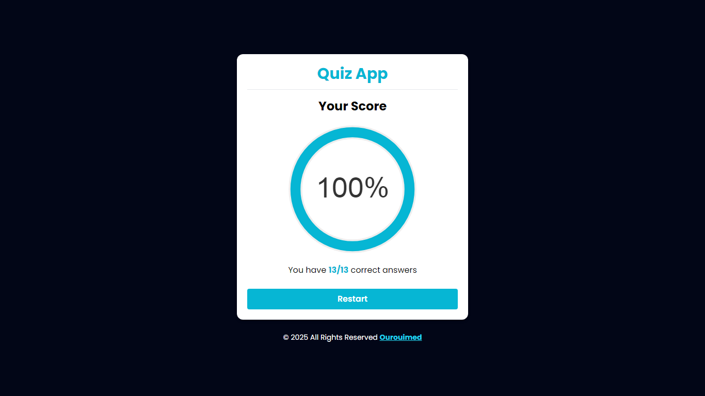

# About this App
This a simple HTML  , JS , CSS & Tailwind css Quiz App
## Installation
1 - download or clone this app
```bash
git https://github.com/Ourouimed/quiz_app.git
```
2 - Open `index.html` file with live server (required)
<br>
3 - Open `qusetions.json` file to update questions :
```bash
[
    {
        "question": "your question here",
        "answers": 
        [
            {
                "answer": "Answer no-1",
                "status": false
            },
            {
                "answer": "Answer no-2",
                "status":  true // 
            },
            .... Array of answers
        ]
    },.... Array of questions
]
                "
```

## 🚀 Used Technologies
- HTML5
- CSS3
- JS
- Tailwind css

## ✨ Features
- Clean, modern UI with Tailwind CSS
- Immediate visual feedback: green for correct, red for incorrect
- Score displayed at the end with a circular chart
- Responsive design for all screen sizes
- JSON-powered quiz content for easy updates

## Live Demo 
This is some screeshots from [Live Demo](https://ourouimed.github.io/quiz_app)



